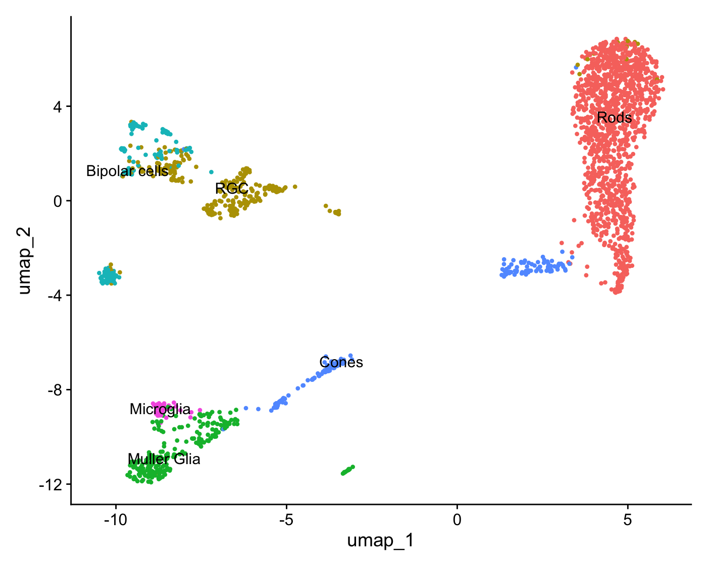
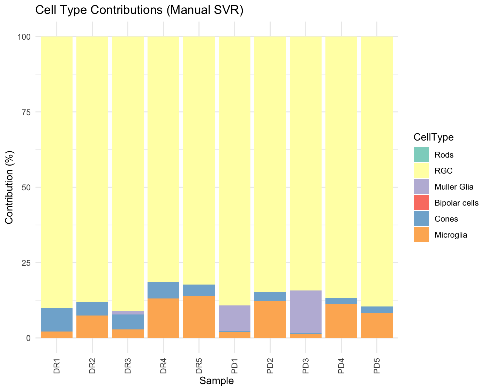

# 👋 Hi, I'm Greeshma Gopinath

🎓 Aspiring PhD researcher in **bioinformatics,molecualar biology and omics**  
🔬 Currently Investigating **cell-to-cell communication in glaucoma** using **scRNA-seq and proteomics**  

---

## 📘 My Research Journey  

My academic background began with a strong foundation in **statistics**, developed during my Master’s degree in biology.  
Through coursework and hands-on practice using **RStudio**, I became experienced in:
- Principal Component Analysis (PCA)  
- Mixed linear models  
- Regression techniques  

This experience helped me realize just how deep statistical methods run in biology,and how critical they are for navigating its complexity and variability in some biological aspects.

As research becomes increasingly **omics data driven**, I’ve been particularly motivated by the potential of high-throughput datasets to reveal cellular-level mechanisms. This has driven me to independently explore and apply computational workflows to publicly available biological datasets.

---

## 🔬 Current Research Focus  

My recent work focuses on understanding **retinal cell extracellular vesicles (EV) communication and degeneration in glaucoma**, through analysis of **transcriptomic and proteomic** data.EVs are critical mediators of cell-to-cell communication, transferring proteins, lipids, and nucleic acids that modulate physiological and pathological processes in recipient cells

---

## 🧬 Highlights of My Work

### 1. **Single-cell RNA-seq (scRNA-seq) Analysis of mouse retina**

I re-analyzed retinal single-cell transcriptomic datasets, including one from [Fadl et al., 2020](https://www.ncbi.nlm.nih.gov/geo/query/acc.cgi?acc=GSE153674), using 10X Genomics data.  
This process helped me gain experience in preprocessing, clustering, annotation, and visualization using **Seurat**.

### 🔎 UMAP of Retina Cells After Filtering

  

  <em>Cells with &lt;200 detected genes or &gt;20% mitochondrial content were excluded.Clustering was performed at resolution 0.8</em>

---

### 2. **Proteomics-Based Deconvolution**

- Constructed a reference matrix from single-cell transcriptomic data  
- Adapted **support vector regression (SVR)**-based deconvolution (inspired by [Newman et al., 2015](https://doi.org/10.1038/nmeth.3337))  
- Applied this to **EV proteomics** to estimate contributions of retinal cell types from[Cioanca et al.,2023](https://doi.org/10.1002/jev2.12393)
- This approach offers a computational strategy for characterizing the cellular origin of EVs, which are otherwise difficult to isolate by cell type experimentally

### 📊 Estimated Cell Type Contributions in EV Proteomics

  

  <em>Estimated cell-type contributions in retinal EV proteomics using SVR-based deconvolution. Control(Dim-reared retina (DR) and PD(Photo oxidative damage model)  EV contributions are higher in Muller glia in PD samples </em>

---

## 🛠️ Skills & Tools  

- R programming (Seurat, ggplot2, dplyr, SVR modeling)  
- Single-cell RNA-seq preprocessing, clustering, and annotation
- Lignad recpetor interactions (Cell chat) (NicheNet)
- Linux and Latex
  

